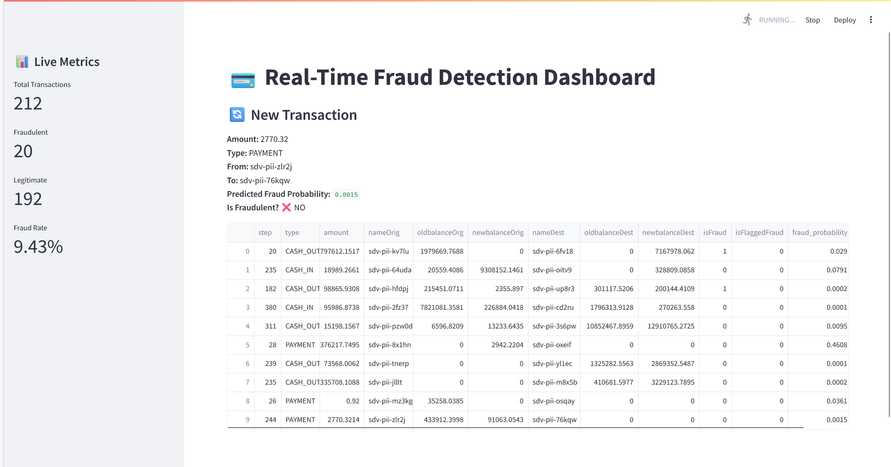

# PaySim Synthetic Dataset Fraud Detection
This example uses Xgboost model to detect mobile payment fraud trained using a synthetic dataset generated using GAN model. This dataset is from Kaggle. For details, see https://www.kaggle.com/ntnu-testimon/paysim1/home

For more detail, see the python notebook **PaySim Synthetic Dataset Fraud Detection.ipynb**
"# fraud-detection-pipeline" 
"# fraud-detection-pipeline" 


# 💳 Fraud Detection Pipeline

This project aims to detect fraudulent financial transactions using machine learning on synthetically generated data based on the PaySim dataset. The goal is to build a robust and reproducible fraud detection pipeline that simulates real-world conditions, using tools like XGBoost for classification.

---

## 📁 Project Structure

```plaintext
fraud-detection-pipeline/
├── data/                  # (Ignored) Synthetic dataset files
├── notebooks/             # Jupyter notebooks for exploration and training
├── src/                   # Source code
│   ├── data_generator.py  # (Optional) CTGAN data generation
│   ├── model_training.py  # XGBoost training script
│   └── utils.py           # Helper functions
├── requirements.txt
├── .gitignore
└── README.md
```
---

## 🧪 Synthetic Data Generation

The dataset used in this project was generated using **CTGAN (Conditional GAN for Tabular Data)**. This ensures:

- Realistic synthetic transactions
- Preservation of relationships between categorical and numerical features
- Class balance control for fraud detection scenarios

**Features modeled include**:
- `type`: Type of transaction (e.g., TRANSFER, CASH_OUT)
- `amount`: Amount of money transacted
- `oldbalanceOrg`, `newbalanceOrig`: Balance before and after for sender
- `oldbalanceDest`, `newbalanceDest`: Balance before and after for receiver
- `isFraud`: Target variable indicating fraud

The synthetic dataset is split into training, validation, and testing sets.

> **Note**: Data files are ignored via `.gitignore` to keep the repository lightweight.

---

## 🎯 Model: XGBoost Classifier

The project uses **XGBoost**, a scalable gradient boosting system, to classify fraudulent transactions.

### ✅ Why XGBoost?

- High performance with tabular data
- Built-in handling of class imbalance
- Easy to interpret feature importance
- Fast training on large datasets

### 🧠 Training Workflow

1. Preprocess data:
   - Label encoding of categorical variables
   - Normalization (if needed)

2. Train/Test Split

3. Model Training:
   ```python
   from xgboost import XGBClassifier

   model = XGBClassifier(scale_pos_weight=30)  # handles class imbalance
   model.fit(X_train, y_train)


---

## 📊 Launching the Streamlit Dashboard

A simple user interface was developed using **Streamlit** to visualize predictions or explore the dataset.

### ▶️ Command to Run

From the root of the project, run the following command:

```bash
streamlit run src/dashboard.py
```

## 📊 Streamlit Interface – Visualization Example

Below is a preview of the Streamlit interface used to explore the model's predictions:



> 📸 This screenshot shows real-time predictions on simulated transactions.


